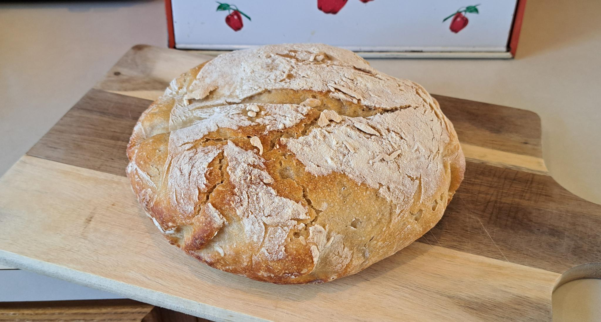

# Trash Bread Sourdough
Open-source Sourdough Bread recipe.

## Ingredients
- 1 cup water
- 3 cup flour
- 1 teaspoon salt
- 0.5 to 1.0 cup sourdough starter

## Instructions
1. Mix all ingredients in a large bowl.
2. Cover and let sit at room temperature for 4 hours.
3. With wet hands, fold dough 3 to 5 times.
4. Cover dough and let it sit for 2 more hours.
5. Transfer dough to a floured work surface and shape into a ball.
6. Cover the surface of the doughball with enough flour to prevent sticking.
7. Transfer dough to a clean bowl and put into a refrigerator for 12+ hours.
8. Remove from fridge and let rise for 5+ hours.
9. Preheat oven to 475°F. (246 °C)
10. Transfer the dough to a baking sheet lined with parchment paper, or to a dutch oven lined with parchment paper.
11. Make a 1" deep cut across the top of the dough.
12. Dust the top surface of the dough with flour.
13. Bake for 25 minutes, or if using a dutch oven for 30 minutes with the lid on then 15 minutes with the lid off.
14. Remove bread from the oven and let it cool completely before serving.
